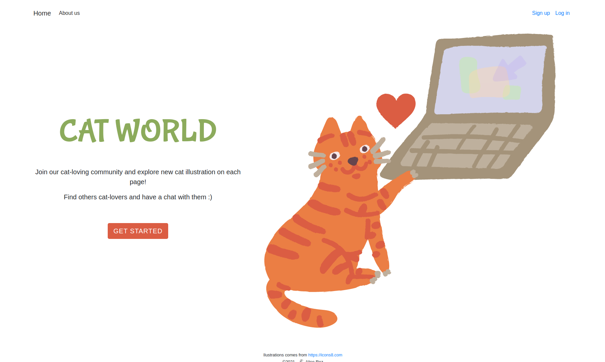
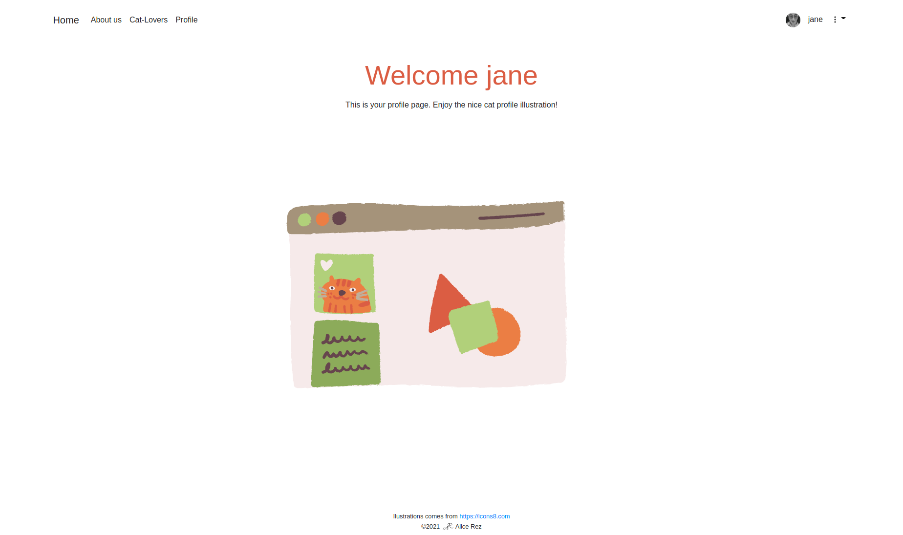
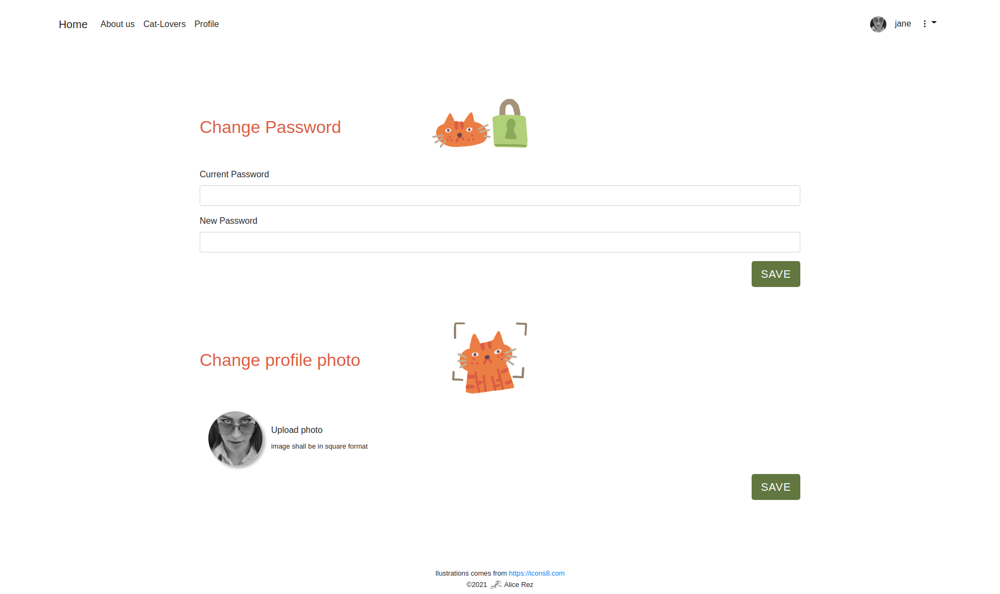

<h1> </h1>

**"Join our cat-loving community and explore new cat illustration on each page!"**

Explore [Live demo](https://cat-world-full.herokuapp.com), look at previews in [Gallery](#gallery) or [Setup](#Setup) the project locally

## Description

Basic MERN fullstack application to create user profiles where some of the functions/pages are available exclusively just for logged users. To make it more interesting, everything is wrapped in cat theme using illustrations from [icons8](https://icons8.com). Made as an exercise during final stage of my one year web development course. Frontend created in React, backend in Express with MongoDB as a database and Mongoose for object modelling [See details](#implemented-features) of implemented features.

### Implemented features:

- Sign up with displaying error messages when inputs does not correspond validations or when user already exists
- Login with displaying error messages when data are not corrected
- Profile page with customized welcome (greeting with user name)
- Parts of the page (user list, profile, settings, messages) visible just when logged-in
- Sign-in and Login links visible just when not logged in
- Possibility to change password (necessity to insert also current password as a security) or add profile image (function just locally, not in deployed version on heroku)
- Basic validation of the form data on backend:
  - email & username unique
  - email have to be in form of email although input is just type text
  - full name can contain just letters & spaces
  - username can contain just letters & number
  - password has to have at least 10 characters
- Data are also trimmed and escaped at backend before inserting them to database or their usage for searching
- Database schema and model using Mongoose
- Authentication using JWT with staying logged in after refreshing page (token stored in cookie)
- encrypting (hashing) passwords using bcrypt

**Used technologies:** React, React Hooks, React Context, Express.js, MongoDB, Bootstrap, CSS-variables, CSS, HTML

**Used packages:** Axios, Mongoose, Multer (for image saving), Cors, Dotenv, Express-validator, uid (uuid used as a name of image file), Bcrypt, Jsonwebtoken,

## Setup

1. clone this repository
2. instal all dependencies using ` npm install` in root and `client`
3. start server in root by `nodemon start`
4. start frontend part in `client` by `npm start`
5. enjoy exploring of the application

## Gallery

**Fig.1** : Profile page after logged in

 
 
 

**Fig.1** : Settings of the new password and profile image

## Acknowledgement

This project was bootstrapped with [Create React App](https://github.com/facebook/create-react-app).
